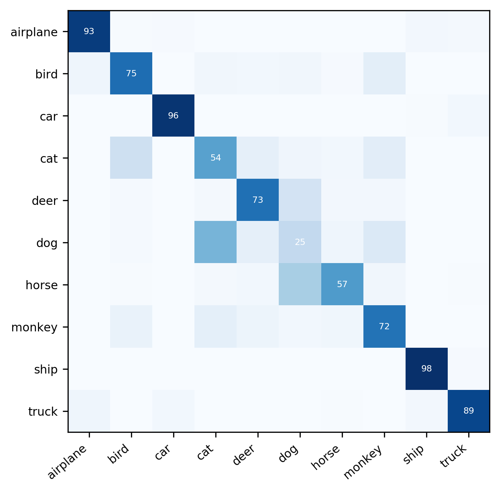

# Learning to Classify Images without Labels

We have already implemented this model on the CIFAR-10 and CIFAR-100 datasets. However, due to the checkpoint mechanism in the code, demonstrating the process again may not be very intuitive, so we will showcase its performance on the STL-10 dataset instead. If you wish to reproduce the applications on the first two datasets, please refer to the "[Addition](#addition)" section.

## Contents
1. [Preparation](#preparation)
0. [Unsupervised Representation Learning Model](#unsupervised-representation-learning-model)
0. [Nearest Neighbor Match](#nearest-neighbor-match)
0. [Visualization](#visualization)
0. [Addition](#addition)

## Preparation
### Repository
Clone the repository and navigate to the directory:   
The Git link will be uploaded after the STL-10 demonstration is completed. 

```bash
git clone https://github.com/Ether2000/NNM.git
cd NNM
```

### Environment
The Python version is 3.7, PyTorch version is 1.6.0, CUDA version is 10.2, and Faiss version is 1.6.2.

Note: Although I may update the code to support the latest packages, many dependencies cannot be upgraded. For example, the latest version of Faiss has significant changes in the output types of many functions, making it difficult to maintain compatibility. Therefore, for convenience, please follow the instructions as-is—this will automatically create a virtual environment named `nnmtry`.

If you need to change the virtual environment name, simply modify the first line of `requirements.yml`.
```bash
conda env create -f requirements.yml
conda activate nnmtry
```

### Paths
For convenience, I have already set up the relative paths. Execute the following code to save the pre-trained model (unsupervised representation learning model) and the deep clustering model (nearest neighbor model). The `results` folder will be generated under the `NNM` directory.


```bash
mkdir -p results/stl-10/pretext/
```

## Unsupervised Representation Learning Model
### Extract Features 
First, we perform the feature extraction task.
Feel free to run this task with the correct config file. This process trains the model by constructing data pairs (composed of augmented data and original data) and assigning positive labels, ultimately achieving the goal of extracting hidden features.
```
python extract_feature.py --config_env configs/env.yml --config_exp configs/pretext/simclr_stl10.yml 

mv simclr_stl-10.pth.tar result/stl-10/pretext/model.pth.tar 
```
If the training module runs smoothly, you will see the following:

 


In order to save time, we can download the pre-train model.  
Download the pretrained model [here](https://drive.google.com/file/d/1261NDFfXuKR2Dh4RWHYYhcicdcPag9NZ/view?usp=sharing) and save it in your `result/stl-10/pretext` directory.
Alternatively, simply run the following code—it will automatically download to the specified path.  
```
gdown --id 1261NDFfXuKR2Dh4RWHYYhcicdcPag9NZ -O ./results/stl-10/pretext/model.pth.ta
```
### Generate Neighbours Waiting for Matching
Run the following code. This will use the pretrained model to extract hidden features, and then generate neighbors based on these hidden features—these neighbors are the candidates for nearest neighbors, which will be used for deep clustering.
```bash
python simclr.py --config_env configs/env.yml --config_exp configs/pretext/simclr_stl10.yml 
```

You should get the following results:


Now, the model has been correctly saved for the clustering step and the nearest neighbors were computed automatically. 

## Nearest Neighbor Match

Next, use the generated neighbor information for deep clustering. NNM is a bottom-up clustering method, but the evaluation criterion is a special loss function. Therefore, the so-called nearest neighbor produced is the one among the neighbor candidates that contributes the smallest loss, rather than the most similar image.
```bash
python scan.py --config_env configs/env.yml --config_exp configs/scan/scan_stl10.yml
```

If everything runs smoothly, you will obtain the following results. These results indicate that using this unsupervised clustering model can achieve an accuracy of 73.58% on STL-10.


## Visualization
Now, we can visualize the confusion matrix and the prototypes of our model. Run the codes as follows, the confusion matrix and the central image of each cluster will be saved in the stl-10 directory.
```bash
mkdir -p stl-10

python eval.py --config_exp configs/scan/scan_stl10.yml --model results/stl-10/scan/model.pth.tar --visualize_prototypes
```
We can see the performance of the unsupervised clustering model on the STL-10 dataset:  



## Addition

If you want to fully run this model on CIFAR-10, execute the following steps in sequence.

```
gdown --id 1_7tua1Sam5T1s9fhopAw3buIBLrnI3dy -O ./results/cifar-10/pretext/model.pth.tar

python simclr.py --config_env configs/env.yml --config_exp configs/pretext/simclr_cifar10.yml

python scan.py --config_env configs/env.yml --config_exp configs/scan/scan_cifar10.yml --gpus 0

mkdir -p cifar-10

python eval.py --config_exp configs/scan/scan_cifar10.yml --model results/cifar-10/scan/model.pth.tar --visualize_prototypes

```  


If you want to fully run this model on CIFAR-100, execute the following steps in sequence.

```
gdown --id 1261NDFfXuKR2Dh4RWHYYhcicdcPag9NZ -O ./results/cifar-20/pretext/model.pth.ta

python simclr.py --config_env configs/env.yml --config_exp configs/pretext/simclr_cifar20.yml

python scan.py --config_env configs/env.yml --config_exp configs/scan/scan_cifar20.yml --gpus 0

mkdir -p cifar-20

python eval.py --config_exp configs/scan/scan_cifar20.yml --model results/cifar-10/scan/model.pth.tar --visualize_prototypes

```


